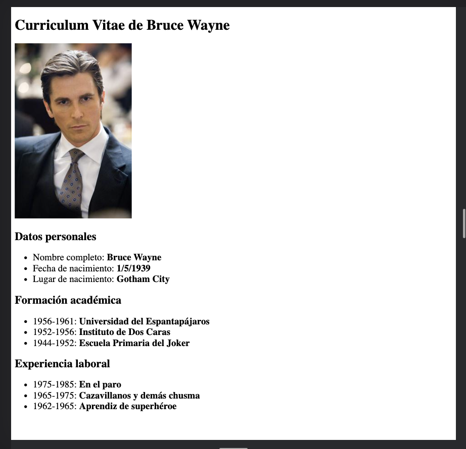
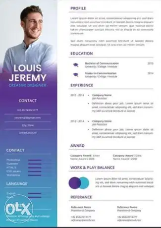
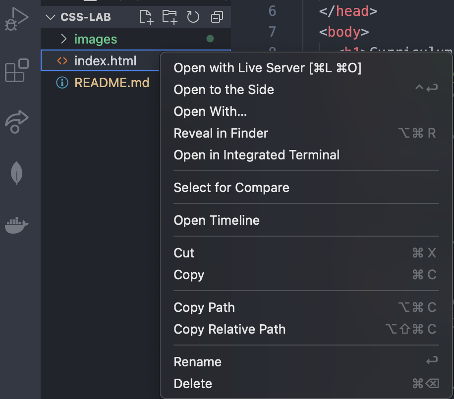
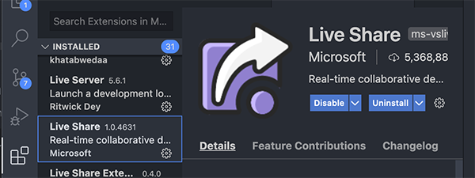

Este es un `laboratorio práctico` del modulo de CSS del curso `JavaScript Front End` de ADA SCHOOL.

## Lo que debes lograr

¿Como convertirías esta aburrida hoja de vida html de Bruce Wayne, mas conocido como `Batman`



en una hoja de vida de carácter institucional, atractiva y organizada, utilizando las habilidades de CSS que acabas de aprender?




## Recomendaciones
Toma en cuenta estas sugerencias para lograr un buen resultado:

- Siéntete libre de modificar `index.html` de la manera que quieras, aumentando o quitando palabras, párrafos o etiquetas.

- Recuerda que el laboratorio final de este módulo será entregar tu propia hoja de vida con estilos, asi que esta es una buena ocasión para que pruebes diferentes ideas. 

- No olvides usar "Grid" y "Flexbox" donde sea necesario.

## Instrucciones

1. Clona este repositorio en tu carpeta de trabajo local.

2. Desvincúlalo del repositorio origen ejecutando el comando de git:

```bash
git remove rm origin
```
3. Con el boton derecho sobre el archivo index.html, elije la opción `open with Live Server` para que index.html se abra en tu navegador y puedas ver los cambios que realizas con CSS. 



Si no tienes esta opción habilitada debes instalar la extensión `Live Share` de VSC (Visual Studio Code).




Si tienes alguna dificultad para configurar adecuadamente tu VSC puedes volver a revisar la sesión en vivo del módulo de VSC o solicitar asistencia en el canal de Slack.

También puedes utilizar Replit si te es mas cómodo y fácil de usar, lo importante es que pongas en `práctica` lo aprendido🤓.

3. Comienza a trabajar 👩🏻‍💻 modificando y creando estilos para la `hoja de vida` de `Batman`. Si tienes dudas, vuelve a revisar los videos del módulo, ya que ahi esta toda la información que necesitas para completar este laboratorio.

4. Avanzado: cuando estes listo con los resultados, puedes subir tu trabajo a tu repositorio personal de GitHub y compartir el link en el canal de Slack para que todos podamos verlo 🚀.

